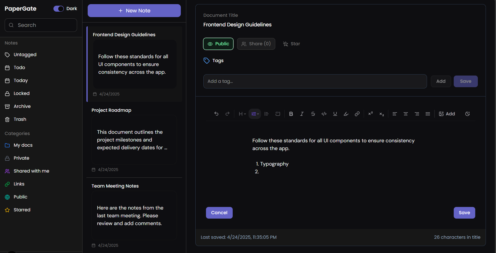

# 📝 Minimal WYSIWYG Editor Frontend

This is the frontend for a rich-text editor project — something between *notion-lite* and *Google Docs on caffeine*. Built using **Next.js**, **TypeScript**, **TailwindCSS**, and the magnificent **Tiptap** editor.

Think: clean design, collaborative intent, with just the right amount of sass hidden in the code comments.

---

## 🚀 Features (so far)

- Full WYSIWYG editing experience with Tiptap
- Markdown-friendly content storage (but evolved into JSON for more power)
- Authenticated access (JWT + HTTP-only cookies)
- Document sharing via link tokens and email users
- Modern frontend stack with Next.js + shadcn + Zustand + React Query
- Full-stack integration (securely connects to backend APIs)


## 📸 Screenshot  


---

## 🧠 Backend Repo  
Check out the backend implementation here:  
[🔗 Backend Repo Link](https://github.com/Sunanda-05/advanced-express-crud)

---

## ⚙️ Quick Setup

```bash
# install dependencies
npm install

# run dev server
npm run dev
